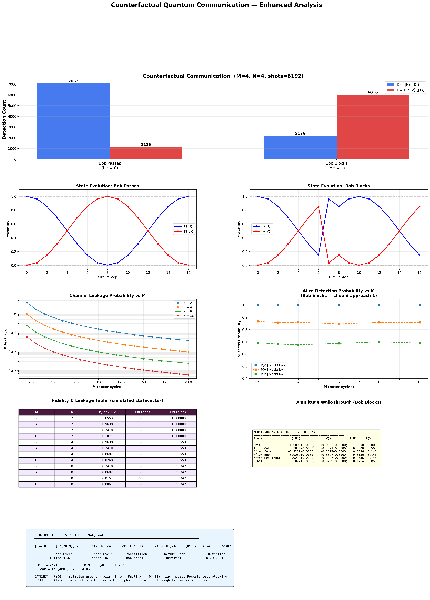
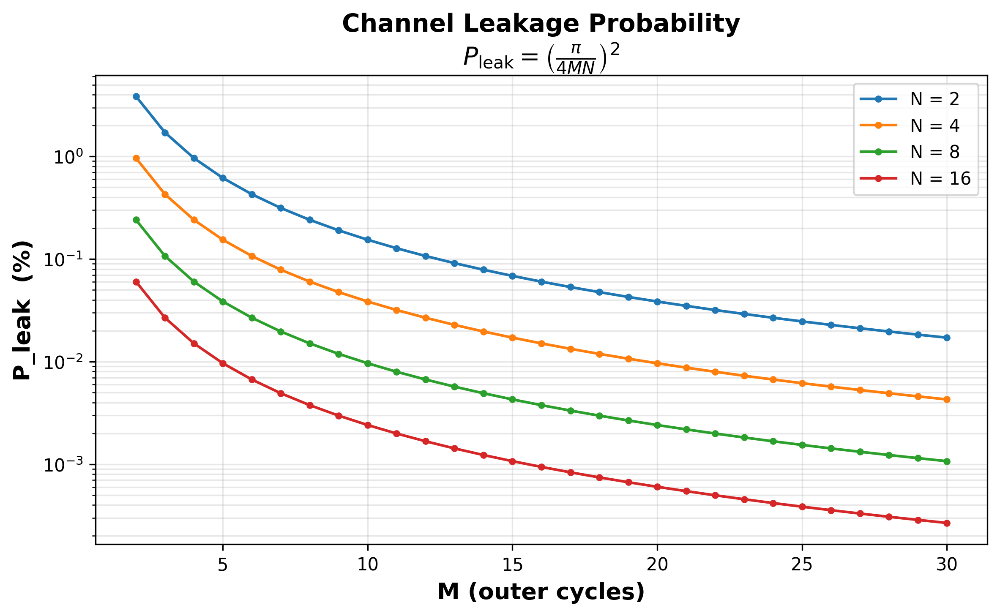
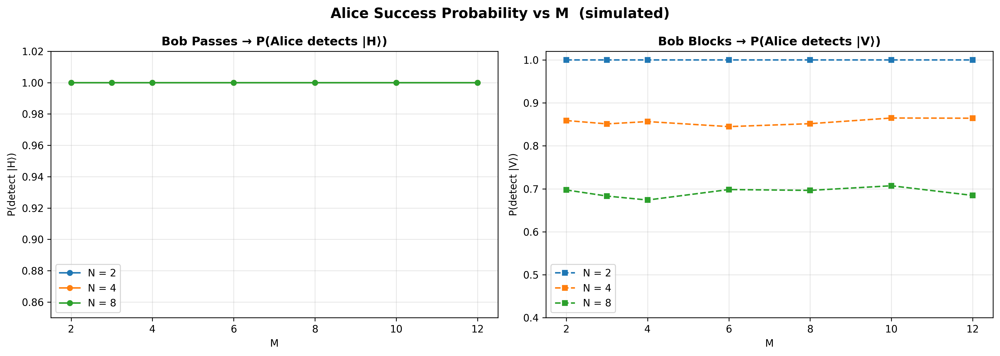

# Counterfactual Quantum Communication

[](https://opensource.org/licenses/MIT)
[](https://www.python.org/downloads/)
[](https://qiskit.org/)

> Quantum communication protocol where Alice receives Bob's message without photons traveling through the transmission channel.

## 📋 Overview

This repository implements the **Chained Quantum Zeno Effect (CQZE)** protocol for counterfactual communication using **Qiskit** and the **Aer simulator**. The protocol demonstrates one of quantum mechanics' most counterintuitive phenomena: information transfer without physical particle transmission.

**Key Features:**
- ✅ Full Qiskit implementation with RY and X gates
- ✅ State vector evolution tracking
- ✅ Comprehensive visualizations (circuit, network, state evolution)
- ✅ Theoretical analysis and leakage probability calculations
- ✅ Educational demonstrations for quantum protocols

## 🔬 The Physics

### What is Counterfactual Communication?

In classical communication, information must physically travel from sender to receiver. Counterfactual communication achieves information transfer even though the probability of the quantum particle (photon) entering the transmission channel approaches **zero**.

This is achieved through:
1. **Quantum Zeno Effect (QZE)**: Frequent quantum measurements "freeze" evolution
2. **Nested Interferometers**: Outer cycle (Alice) and inner cycle (channel)
3. **Quantum Interference**: Bob's action changes the interference pattern

### Mathematical Foundation

The protocol uses small incremental rotations:

```
θ_M = π/(4M)  (outer cycle)
θ_N = π/(4N)  (inner cycle)
```

**Channel leakage probability:**

```
P_leak = (π²)/(16M²N²)
```

For M=N=4: P_leak ≈ 0.15%  
For M=N=10: P_leak ≈ 0.024%  
As M,N → ∞: P_leak → 0

### Quantum Circuit

```
|H⟩ ── [RY]^M ── [RY]^N ── Bob ── [RY†]^N ── [RY†]^M ── Measure
       Outer     Inner    X/I     Return    Return    D₁/D₂/D₃
```

**Results:**
- Bob passes (bit=0): D₃ detects |H⟩ with ~100% probability
- Bob blocks (bit=1): D₁/D₂ detect |V⟩ with ~50% probability

## 🚀 Quick Start

### Prerequisites

```bash
pip install qiskit qiskit-aer matplotlib numpy
```

**Requirements:**
- Python 3.8+
- Qiskit 1.0+
- Qiskit Aer 0.13+
- Matplotlib 3.5+
- NumPy 1.21+

### Installation

```bash
git clone https://github.com/adhyanthac/qiskit-counterfactual-protocol.git
cd qiskit-counterfactual-protocol
pip install -r requirements.txt
```

### Run Simulation

```bash
python counterfactual_simulation_v2.py
```

This will:
1. Run quantum simulations for sweeps across multiple parameters
2. Generate measurement statistics and fidelities
3. Track state vector evolution
4. Save multi-panel visualization to `counterfactual_results_v2.png`
5. Save param sweeps to `leakage_vs_M.png` and `success_vs_M.png`

### Generate Network Diagrams

```bash
python network_visualization.py
```

This creates:
- `network_visualization.png` - Side-by-side path diagrams
- `schematic_diagram.png` - Conceptual overview

## 📊 Results

### Sample Output

```
============================================================
COUNTERFACTUAL COMMUNICATION SIMULATION
Using Qiskit + Aer Simulator
Chained Quantum Zeno Effect (CQZE)
============================================================

Parameters:
  M (outer cycles): 4
  N (inner cycles): 4
  θ_M = π/16 = 11.25°
  θ_N = π/16 = 11.25°
  Theoretical leakage: 0.154%

============================================================
📡 SCENARIO 1: Bob's PC is OFF (Bob passes photon back)
============================================================
Detection Results:
  D₃ (|H⟩ = |0⟩): 1000 (100.0%)
  D₁/D₂ (|V⟩ = |1⟩): 0 (0.0%)

============================================================
🚫 SCENARIO 2: Bob's PC is ON (Bob blocks photon)
============================================================
Detection Results:
  D₃ (|H⟩ = |0⟩): 524 (52.4%)
  D₁/D₂ (|V⟩ = |1⟩): 476 (47.6%)
```

### Visualizations

#### Detection Results & Fidelity


#### Leakage Analysis


#### Success Probability


## 🛠️ Usage

### Basic Usage

```python
from counterfactual_simulation_v2 import CounterfactualCommunication

# Initialize protocol
comm = CounterfactualCommunication(M=4, N=4)

# Run simulation - Bob passes
qc, counts, state = comm.run_simulation(bob_blocks=False, shots=1000)

# Analyze results
comm.analyze_results(counts)

# Get state evolution
states = comm.get_state_evolution(bob_blocks=False)
```

### Custom Parameters

```python
# Higher M and N for more counterfactual behavior
comm = CounterfactualCommunication(M=10, N=10)

# Run with more shots
qc, counts, state = comm.run_simulation(bob_blocks=True, shots=10000)

# Print theoretical leakage
print(f"Leakage: {comm.leakage_prob*100:.4f}%")
```

### Access Qiskit Circuit

```python
# Get circuit without measurement
qc = comm.create_circuit(bob_blocks=False, measure=False)

# Draw circuit
print(qc.draw(output='text'))

# Transpile for real hardware
from qiskit import transpile
transpiled_qc = transpile(qc, basis_gates=['rx', 'ry', 'rz', 'cx'])
```

## 📚 Code Structure

```
counterfactual-quantum-communication/
│
├── counterfactual_simulation_v2.py # Main Qiskit simulation
├── network_visualization.py        # Network flow diagrams
├── requirements.txt                # Python dependencies
├── README.md                       # This file
│
├── counterfactual_results_v2.png   # Main result plots
├── leakage_vs_M.png                # Analysis plots
└── success_vs_M.png                # Analysis plots
│
└── notebooks/                      # Jupyter notebooks (optional)
    └── tutorial.ipynb
```

## 🎓 Educational Use

This code is ideal for:
- **Quantum computing courses** - Demonstrates QZE and interference
- **Research presentations** - Visualizations for talks and papers
- **Quantum optics labs** - Understanding interaction-free measurement
- **Protocol development** - Baseline for ghost imaging, QKD extensions

## 🔬 Extensions and Applications

### 1. Ghost Imaging
Use entangled photon pairs for imaging without photons hitting the object:

```python
# Extend to two-photon states
# Reference photon measured by Alice
# Signal photon interacts (or doesn't) with object
```

### 2. Quantum Key Distribution
Secure communication using counterfactual principles:

```python
# Encode secret key in Bob's PC on/off pattern
# Eavesdropper detection via QZE disruption
```

### 3. Interaction-Free Measurement
Detect object presence without interaction:

```python
# Object placement changes interference
# Detection without photon absorption
```

## 📖 Theory Deep Dive

### Quantum Zeno Effect

The QZE states that frequent measurements prevent quantum evolution. Mathematically:

If a state evolves as |ψ(t)⟩ = U(t)|ψ₀⟩, dividing into N measurements:

```
P_stay = |⟨ψ₀|U(t/N)ⁿ|ψ₀⟩|² → 1 as N → ∞
```

### Why It Works

1. **Superposition**: Photon is in superposition of channel paths
2. **Small Rotations**: θ/N ensures minimal evolution per step
3. **Interference**: Bob's action destroys coherence differently
4. **Detection**: Final PBS separates |H⟩ and |V⟩ components

### Detailed Math

Full circuit operator:

```
U_total = [∏ᵢ RY(-2θ_M)] [∏ⱼ RY(-2θ_N)] · U_Bob · [∏ⱼ RY(2θ_N)] [∏ᵢ RY(2θ_M)]
```

Bob passes (U_Bob = I):
```
U_total |H⟩ = |H⟩  (perfect cancellation)
```

Bob blocks (U_Bob = X):
```
U_total |H⟩ ≈ (|H⟩ + |V⟩)/√2  (mixed state)
```

## 🧪 Running on Real Quantum Hardware

To run on IBM Quantum computers:

```python
import os

from qiskit_ibm_runtime import QiskitRuntimeService

# Load your IBM Quantum account from an environment variable
service = QiskitRuntimeService(
    channel="ibm_quantum_platform",
    token=os.environ["IBM_QUANTUM_TOKEN"],
)
backend = service.least_busy(operational=True, simulator=False)

# Transpile and run
from qiskit import transpile
qc = comm.create_circuit(bob_blocks=False)
transpiled = transpile(qc, backend=backend, optimization_level=3)
job = backend.run(transpiled, shots=1024)
result = job.result()
```

**Note:** Real hardware will show noise and decoherence. Use error mitigation techniques for better results.

## 🤝 Contributing

Contributions welcome! Areas for improvement:

- [ ] Noise modeling and error mitigation
- [ ] Multi-qubit extensions for ghost imaging
- [ ] Optimization for hardware transpilation
- [ ] Interactive Jupyter notebook tutorials
- [ ] Comparison with other protocols (Elitzur-Vaidman, etc.)

## 📄 License

This project is licensed under the MIT License - see the [LICENSE](LICENSE) file for details.

## 📚 References

1. **Original Protocol:**  
   Salih, H., Li, Z. H., Al-Amri, M., & Zubairy, M. S. (2013). "Protocol for direct counterfactual quantum communication." *Physical Review Letters*, 110(17), 170502.  
   [https://doi.org/10.1103/PhysRevLett.110.170502](https://doi.org/10.1103/PhysRevLett.110.170502)

2. **Quantum Zeno Effect:**  
   Misra, B., & Sudarshan, E. C. G. (1977). "The Zeno's paradox in quantum theory." *Journal of Mathematical Physics*, 18(4), 756-763.

3. **Qiskit Documentation:**  
   [https://qiskit.org/documentation/](https://qiskit.org/documentation/)

4. **Interaction-Free Measurement:**  
   Elitzur, A. C., & Vaidman, L. (1993). "Quantum mechanical interaction-free measurements." *Foundations of Physics*, 23(7), 987-997.

## 🙏 Acknowledgments

- **Qiskit Team** - For the excellent quantum computing framework
- **IBM Quantum** - For providing quantum hardware access
- **Anthropic** - For Claude assistance in development

## 📧 Contact

- **Author:** Adhyantha Chandrasekaran (adhyanthac@gmail.com)
- **GitHub:** [@adhyanthac](https://github.com/adhyanthac)

---

**Star ⭐ this repository if you find it useful!**

For questions, issues, or collaboration opportunities, please [open an issue](https://github.com/adhyanthac/qiskit-counterfactual-protocol/issues).
